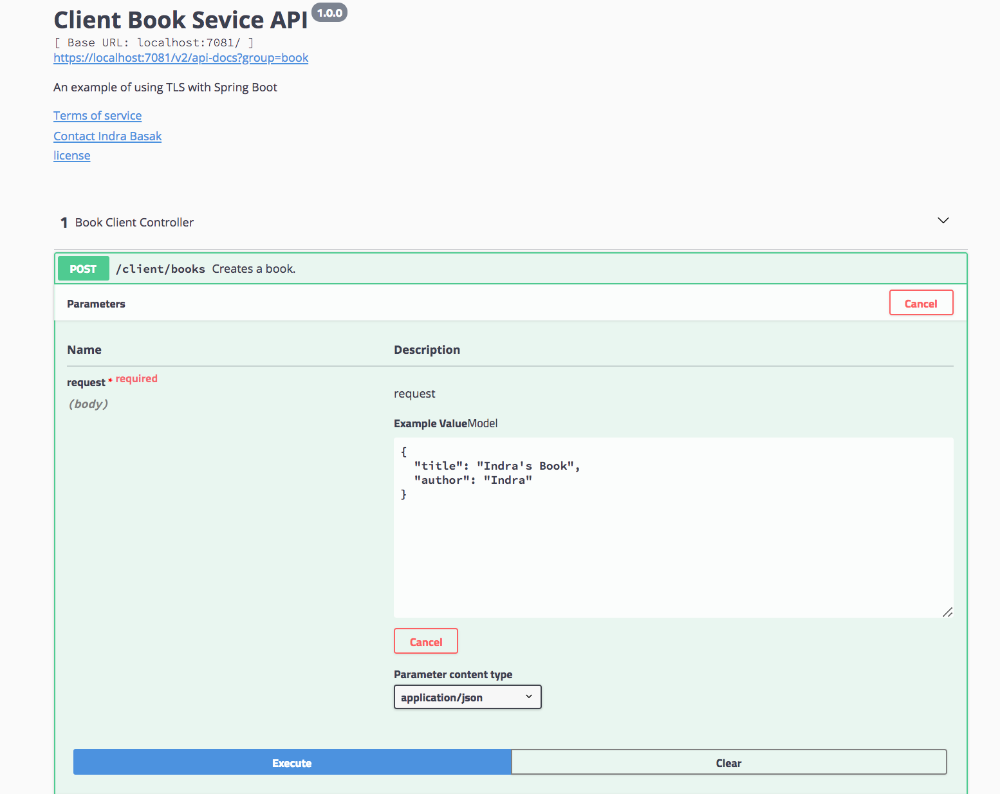
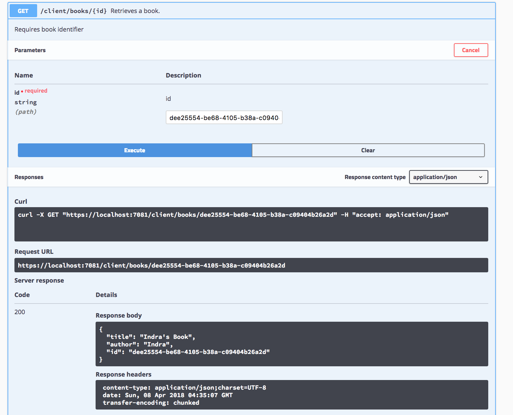

[![Build Status][travis-badge]][travis-badge-url]
[![Quality Gate][sonarqube-badge]][sonarqube-badge-url] 
[![Technical debt ratio][technical-debt-ratio-badge]][technical-debt-ratio-badge-url] 
[![Coverage][coverage-badge]][coverage-badge-url]


Spring TLS Example
==================================
This is an example of using TLS (Transport Layer Security) with Spring Boot. 
In this example, TLS is enabled in both server and client. Basic Access 
Authorization is also enabled on the server side.

### Introduction to TLS
Transport Layer Security (TLS) is a protocol that provides privacy and 
data integrity between two communicating applications, e.g., server and client.
It's replacement for Secure Sockets Layer (SSL).

TLS provides a secured communication by encrypting the data transmitted
using symmetric cryptography.

### Key and Certificate Creation

Java **keytool** is a key and certificate management utility. It allows users to
do the following:

1. Create and manage their own **public/private key pairs** and **certificates**.
A **certificate** contains the **public key** (and some other information) 
used for authentication.

1. Allows to cache private keys and certificates in a file called **keystore**.
A keystore may contain any certificate required to complete a chain of trust. 
Each certificate is associated with a unique **alias**. The private keys are 
protected with a **password**.

A keytool is part of the standard java distribution. For example in In MAC OS, 
it is located under:
 
 `/Library/Java/JavaVirtualMachines/jdk1.8.0_162.jdk/Contents/Home/bin`

The `generate-key.ssh` shell script under `script` folder can be executed to
create keys and certificates. It does the following:

1. Generate a **RSA 2048 public/private key pairs** for the server and store 
in the the server **keystore** of type `PKCS12`. The server keystore,
`server-keystore.p12`, is created in the `server/main/resources/config` folder.

1. Generate a **RSA 2048 public/private key pairs** for the client and store 
in the client **keystore** of type `PKCS12`. The client keystore, 
`client-keystore.p12` is created in the `client/main/resources/config` folder.

1. Export the server's **certificate**. A file named `server-public.cer` is
created in the `script` folder.

1. Export the client's **certificate**, A file named `client-public.cer` is
created in the `script` folder.

1. Import the server certificate, `server-public.cer` in the client's 
keystore, `client-keystore.p12`.

1. Import the client certificate, `server-public.cer` in the client's 
   keystore, `server-keystore.p12`(optional for TLS).
   
### Configure TLS (SSL) in Spring Boot Server

TLS is configured in the Spring Boot server by the `server.ssl.*` properties 
in the `application.yml`. Here is how the example server is configured in the server
`application.yml` file:

```yaml
server:
  port: 8443
  ssl:
    key-store-type: PKCS12
    key-store: classpath:config/server-keystore.p12
    key-store-password: server
    key-alias: server
```

- `server.port` specifies the SSL port of the server. Spring Boot does not 
support the configuration of both an HTTP connector and an HTTPS connector 
via the `application.yml`.

- `server.ssl.key-store-type` specifies the **type** of Java **keystore**. In this
example, the keystore is of `PKCS12` type. The other option is `JKS`, a proprietary 
Java specific format. Oracle recommends `PKCS12` format.

- `server.ssl.key-store` specifies the **location** of the **keystore**. In 
this example, the file `server-keystore.p12` (server keystore) in located in the 
`resources` folder.

- `server.ssl.key-store-password` is the **password** used during the 
creation of the **keystore** to protect the **private key** by using 
the **keytool**.

- `server.ssl.key-alias` is the **alias** used during the creation of the 
**keystore** using the **keytool** utility.

### Enable TLS in Spring Boot Client


#### Configure a SSL Context with Trusted Store

Here is an example of creating a secured `SSLContext` which is used
to validate the identity of the HTTPS server against a list of trusted 
certificates stored in the **trust-store**.   

```java
private HttpClient httpClient() throws IOException, GeneralSecurityException {
    SSLContext sslcontext =
        SSLContexts.custom()
            .loadTrustMaterial(
                creatKeyStore(sslProperties.getTrustStore(),
                    sslProperties.getTrustStoreType(),
                    sslProperties.getTrustStorePassword()),
                null)
            .build();
    ...        
}            
```

The client rejects any connection during the TLS handshake if the HTTPS
 server tries to authenticate with a certificate not present in the trusted store.
 
Configuring `keystore` in SSL context is **optional**.

```java
private HttpClient httpClient() throws IOException, GeneralSecurityException {
    SSLContext sslcontext =
        SSLContexts.custom()
            ...
            .loadKeyMaterial(
                creatKeyStore(sslProperties.getKeyStore(),
                    sslProperties.getKeyStoreType(),
                    sslProperties.getKeyStorePassword()),
                sslProperties.getKeyPassword().toCharArray())
            .build();
    ...        
}           
```
 
Here is the code for method `creatKeyStore`:
 
 ```java
    private KeyStore creatKeyStore(Resource resource, String storeType,
            String password) throws IOException, GeneralSecurityException {
        KeyStore ks = KeyStore.getInstance(storeType);
        ks.load(resource.getInputStream(), password.toCharArray());

        return ks;
    }
```

#### Create HttpClient

Once the SSL context is created, create the connection factory with the
newly created SSL context and the `NoopHostnameVerifier`. 

```java
private HttpClient httpClient() throws IOException, GeneralSecurityException {
    ... 
    SSLConnectionSocketFactory socketFactory =
        new SSLConnectionSocketFactory(sslcontext, new NoopHostnameVerifier());
            
    HttpClientBuilder builder = HttpClients.custom();           
    builder.setSSLSocketFactory(socketFactory);

    return builder.build();
}
 ```     
 
The `SSLConnectionSocketFactory.getDefaultHostnameVerifier()` is not used
since it tries to match the server host name with the CN (common name) RDN 
in the DN (distinguished name) provided in the server certificate. It's not used 
as it's very restrictive. Where as `NoopHostnameVerifier()` doesn't verify host 
name at all.  

### Create RestTemplate

Here is the code snippet for creating the `RestTemplate`:

```java
@Bean
public RestTemplate restTemplate() throws IOException, URISyntaxException,
    GeneralSecurityException {
    RestTemplateBuilder builder = new RestTemplateBuilder();
    
    return builder.basicAuthorization(properties.getUsername(), 
                       properties.getPassword())
                  .rootUri(clientURI())
                  .messageConverters(
                       new MappingJackson2HttpMessageConverter(objectMapper),
                       new StringHttpMessageConverter())
                  .requestFactory(requestFactory())
                  .errorHandler(new CustomErrorHandler(objectMapper))
                  .build();
}                  

private Supplier<ClientHttpRequestFactory> requestFactory() throws
            IOException, GeneralSecurityException {
    HttpComponentsClientHttpRequestFactory requestFactory
        = new HttpComponentsClientHttpRequestFactory();

    requestFactory.setHttpClient(httpClient());
    requestFactory.setConnectTimeout(properties.getConnectionTimeout());
    requestFactory.setReadTimeout(properties.getReadTimeout());

    return () -> requestFactory;
}

```

You can find the complete client code in `ClientConfiguration.java`.

### Configure TLS (SSL) in Spring Boot Client

It's similar to the server SSL properties. If you don't want HTTPS turned-on in 
client, you should specify the `trust-store` properties under a different 
prefix other than `server.ssl.*`. The properties are in client `application.yml`.

```yaml
server:
  ssl:
    trust-store-type: PKCS12
    trust-store: classpath:config/client-keystore.p12
    trust-store-password: client
    key-store-type: PKCS12
    key-store: classpath:config/client-keystore.p12
    key-password: client
    key-store-password: client
    key-alias: client
```

### Build
To build the JAR, execute the following command from the parent directory:

```
mvn clean install
```

This should build the following Spring Boot jars:

- The server jar, `spring-tls-server-1.1.0.jar`, located in `server/target`
folder.

- The client jar, `spring-tls-client-1.1.0.jar`, located in `client/target`
folder.

### Run Server
To start the server, run the executable jar from the command:

```bash
java -jar server/target/spring-tls-server-1.1.0.jar

...
018-04-07 20:28:06.534  INFO 3379 --- [           main] d.s.w.p.DocumentationPluginsBootstrapper : Context refreshed
2018-04-07 20:28:06.568  INFO 3379 --- [           main] d.s.w.p.DocumentationPluginsBootstrapper : Found 1 custom documentation plugin(s)
2018-04-07 20:28:06.592  INFO 3379 --- [           main] s.d.s.w.s.ApiListingReferenceScanner     : Scanning for api listing references
2018-04-07 20:28:07.426  INFO 3379 --- [           main] o.s.b.w.embedded.tomcat.TomcatWebServer  : Tomcat started on port(s): 8443 (https) with context path ''
2018-04-07 20:28:07.430  INFO 3379 --- [           main] com.basaki.server.ServerApplication      : Started ServerApplication in 9.285 seconds (JVM running for 9.84)

```

This should start the server at port `8443`. From the browser, you can access
the server swagger UI page at `https://localhost:8443/swagger-ui.html`.


### Run Client
Similarly, run the executable jar from the command to start the client:

```bash
java -jar client/target/spring-tls-client-1.1.0.jar

...
und 1 custom documentation plugin(s)
2018-04-07 21:31:22.142  INFO 4633 --- [           main] s.d.s.w.s.ApiListingReferenceScanner     : Scanning for api listing references
2018-04-07 21:31:22.461  INFO 4633 --- [           main] o.s.b.w.embedded.tomcat.TomcatWebServer  : Tomcat started on port(s): 7081 (https) with context path ''
2018-04-07 21:31:22.465  INFO 4633 --- [           main] com.basaki.client.ClientApplication      : Started ClientApplication in 4.169 seconds (JVM running for 4.71)
```

This should start the client at port `7081`. From the browser, you can access
the client swagger UI page at `https://localhost:7081/swagger-ui.html`.

### Usage
- Access the client Swagger UI at `https://localhost:7081/swagger-ui.html`. 

- Make a POST request to create a book. The client in turn makes a request to the
server to create a book.



- If the request is successful, you should get a similar response as shown below:


- Make a GET request to retrieve the newly created book. The client in turn
 makes a request to the server to retrieve the book. An example response 
 is shown below:
 
 
 

[travis-badge]: https://travis-ci.org/indrabasak/spring-tls-example.svg?branch=master
[travis-badge-url]: https://travis-ci.org/indrabasak/spring-tls-example/

[sonarqube-badge]: https://sonarcloud.io/api/project_badges/measure?project=com.basaki%3Aspring-tls-example&metric=alert_status
[sonarqube-badge-url]: https://sonarcloud.io/dashboard/index/com.basaki:spring-tls-example 

[technical-debt-ratio-badge]: https://sonarcloud.io/api/project_badges/measure?project=com.basaki%3Aspring-tls-example&metric=sqale_index
[technical-debt-ratio-badge-url]: https://sonarcloud.io/dashboard/index/com.basaki:spring-tls-example 

[coverage-badge]: https://sonarcloud.io/api/project_badges/measure?project=com.basaki%3Aspring-tls-example&metric=coverage
[coverage-badge-url]: https://sonarcloud.io/dashboard/index/com.basaki:spring-tls-example
